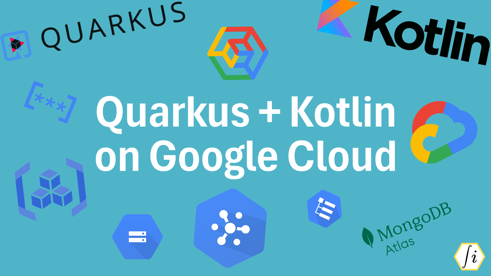

# Quarkus + Kotlin on Google Cloud

This is the Git repository for the course **Quarkus + Kotlin on Google Cloud**, hosted on [Swinnovate Courses](https://courses.swinnovate.com/).

To register for the **Quarkus + Kotlin on Google Cloud** course, **[click here](https://courses.swinnovate.com/enroll/quarkus-with-gcp)**. Also, explore other exciting courses at Swinnovate Courses.

The course is structured into multiple sections, covering key concepts step by step. Below is an outline of the sections:

| Serial Number | Section Name                                                      | Link                                                                        |
|---------------|-------------------------------------------------------------------|-----------------------------------------------------------------------------|
| 1             | Building a Todo Application with Quarkus                          | [Section 2](https://github.com/snitish2607/quarkus-with-gcp/tree/section-2) |
| 2             | Setting Up a Google Cloud Project and Integration with Quarkus    | [Section 3](https://github.com/snitish2607/quarkus-with-gcp/tree/section-3) |
| 3             | Google Cloud Logging for Quarkus                                  | [Section 4](https://github.com/snitish2607/quarkus-with-gcp/tree/section-4) |
| 4             | Integrating Google Cloud Storage with Quarkus                     | [Section 5](https://github.com/snitish2607/quarkus-with-gcp/tree/section-5) |
| 5             | Messaging with Google Cloud Pub/Sub in Quarkus                    | [Section 6](https://github.com/snitish2607/quarkus-with-gcp/tree/section-6) |
| 6             | Pushing Quarkus Artifacts to Google Artifact Registry             | [Section 7](https://github.com/snitish2607/quarkus-with-gcp/tree/section-7) |
| 7             | Deploying a Quarkus Application to Google Kubernetes Engine (GKE) | [Section 8](https://github.com/snitish2607/quarkus-with-gcp/tree/section-8) |
| 8             | Integrating Google Secret Manager with GKE and Quarkus            | [Section 9](https://github.com/snitish2607/quarkus-with-gcp/tree/section-9) |

---


## Running the application in dev mode

You can run your application in dev mode that enables live coding using:

```shell script
./mvnw compile quarkus:dev
```

## Packaging and running the application

The application can be packaged using:

```shell script
./mvnw package
```

It produces the `quarkus-run.jar` file in the `target/quarkus-app/` directory.

The application is now runnable using `java -jar target/quarkus-app/quarkus-run.jar`.

---

<sub><sup>Logos and trademarks used in the course banner are the property of their respective owners.</sup></sub>

